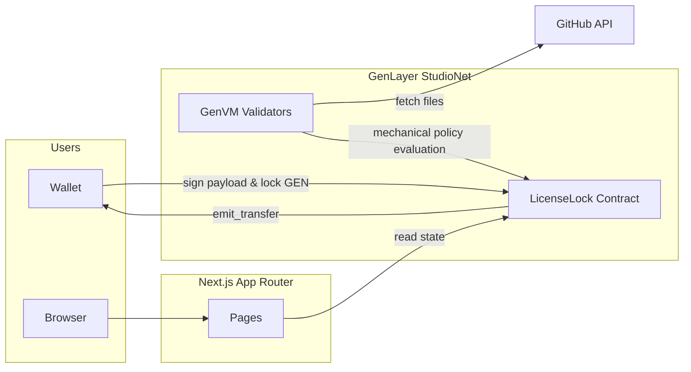
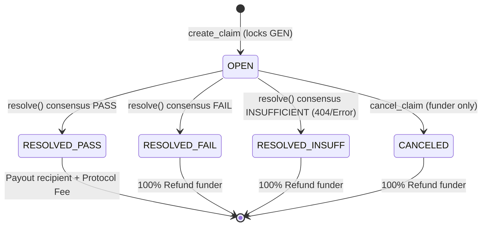

# 🛡️ LicenseLock

**Open-Source License Escrow on GenLayer.** Lock GEN tokens against a GitHub commit, trigger decentralized validators to perform mechanical license verification, and settle payouts or refunds based purely on on-chain verification.


[](https://nextjs.org)
[](https://www.genlayer.com)

**Live production dApp:** [licenselock.vercel.app](https://licenselock.vercel.app)

Live StudioNet Contract: `0x9805726af17aa87567d8fac8bd737851Ebb87d44`


LicenseLock is an autonomous protocol bridging decentralized escrow with real-world open-source compliance. Validators fetch target repository files at a specific commit, perform strict mechanical string comparisons against declared licenses, and route native GenLayer value based on the verified outcome.

---

## At a glance

- **The loop:** lock GEN against a repo → validators fetch evidence and evaluate policies → reach consensus (PASS, FAIL, or INSUFFICIENT) → execute native transfers.
- **Three mechanical claim types:** `SPDX_MATCH`, `NO_COPYLEFT`, and `ALLOWED_LICENSE_SET`.
- **The one thing worth knowing before anything else:** This protocol was engineered to directly address and resolve the strict architectural constraints established in the Alpha Court, Sybil Court, and Provider Court core team reviews. 

Jump to: [Core Team Audit Resolutions](#core-team-audit-resolutions) · [What LicenseLock is](#what-licenselock-is) · [Architecture](#architecture) · [Local development](#local-development)

---

## Core Team Audit Resolutions

This architecture was explicitly hardened against the findings of prior GenLayer application reviews:

**1. No Trapped Funds & Deterministic Settlement (Alpha Court Resolution)**
Alpha Court highlighted the danger of custodying funds without guaranteed return paths. LicenseLock implements strict error handling with guaranteed refund paths. If a node cannot locate target files or faces missing declarations, it safely resolves to `INSUFFICIENT`, unconditionally refunding the funder rather than crashing the VM (Status: 6) and trapping state. Furthermore, a strict `cancel_claim` emergency hatch allows funders to reclaim escrows from `OPEN` claims.

**2. Strict Authentication & State-Driven Payouts (Sybil Court Resolution)**
Sybil Court was critiqued for unauthenticated interfaces and disjointed mechanics. LicenseLock normalizes all `msg.sender` addresses and enforces strict access control on cancellations. The UI promises no false mechanics; the `resolve` function actively executes `gl.get_contract_at().emit_transfer()` natively routing funds directly based on consensus state, completely bypassing vulnerable off-chain keeper dependencies.

**3. Scoped, Accurate Parsing without Scope Creep (Provider Court Resolution)**
To prevent false positives, `NO_COPYLEFT` strictly checks declared license headers in scoped `LICENSE` files and parses only the `"license"` field in package manifests (`package.json`, `pyproject.toml`, `Cargo.toml`). It never naively greps raw body texts (preventing false fails on words like "application") and ignores lockfiles.

**4. Fail-closed repository scope (this steward request)**
create_claim requires an immutable 40-character hex SHA (no main/HEAD/short/all-zero).
A declared target_directory never falls back to repo root; missing prefix → INSUFFICIENT + refund.
404 is MISSING; 429/5xx/network is UNAVAILABLE; UNAVAILABLE never PASSes.
NO_COPYLEFT inspects package.json, Cargo.toml, and pyproject.toml before payout.

---

## What LicenseLock is

### Claim Types

| Type | Question Shape |
|---|---|
| **SPDX Match** | Do the README and LICENSE files explicitly match declared SPDX identifiers? |
| **No Copyleft** | Is the repository free of viral licenses (e.g., GPL, AGPL, MPL) in the scoped LICENSE and manifest `license` fields? |
| **Allowed Licenses** | Does the repository strictly use a license from a user-provided allowlist array? |

### Lifecycle in plain language

1. Someone **creates a claim**, locking a native GEN escrow against a specific GitHub commit and policy. State is **OPEN**.
2. The user (or any authorized party) triggers **Execute Resolution**.
3. GenLayer validators execute the Nondeterministic Virtual Machine (`gl.nondet`):
    - They fetch files precisely at the exact immutable commit SHA, scoped strictly to the target directory with no root fallback.
    - They evaluate the declared license headers and manifest fields deterministically.
4. Consensus is reached and state transitions:
    - **PASS:** The protocol deducts a 2.5% protocol fee to the treasury and transfers the remainder to the recipient. State: **RESOLVED**.
    - **FAIL / INSUFFICIENT:** Evidence is missing or policy is violated. 100% of the escrow is returned to the funder. State: **RESOLVED**.
5. Alternatively, before resolution, the funder can manually abort. State: **CANCELED** (100% refunded).

---

## Architecture



### State Machine



### Tech Stack

| Layer | Stack |
|---|---|
| **App** | Next.js 16 App Router, React, Tailwind CSS |
| **Chain** | GenLayer Intelligent Contract (Python), StudioNet |
| **Wallet** | genlayer-js + viem + MetaMask |
| **Consensus** | GenVM Nondeterministic Web Fetches & Multi-Validator Consensus |
| **Tests** | pytest + gltest (23/23 Direct Integration Tests passing) |


---

## Local Development

### Prerequisites
- Node.js 18+ and `npm`
- Python 3.10+
- GenLayer StudioNet account / localnet

### Setup
```bash
# Clone the repository
git clone https://github.com/edwarderlick/LicenseLock.git
cd LicenseLock

# Install Node dependencies
npm install

# Run frontend development server
npm run dev

# Run smart contract integration tests
pytest tests/direct/test_licenselock.py -v

# Run native EOA payout verification script
node scripts/verify_payout.mjs 0x655c4fA424c900fF57F4B9B4E58049ae83EecCAe
```

---

## Native Payout Verification (IC -> EOA)

Unlike Alpha Court, LicenseLock natively transfers GEN from the Intelligent Contract to the EOA using `emit_transfer()`. This is not a keeper illusion.

We provide a dedicated verification script ([`scripts/verify_payout.mjs`](./scripts/verify_payout.mjs)) connecting via `viem` to the GenLayer StudioNet RPC to query on-chain `eth_getBalance` deltas:

```bash
node scripts/verify_payout.mjs 0x655c4fA424c900fF57F4B9B4E58049ae83EecCAe
```

**Verified Terminal Output Proof:**
```text
===============================================================
  🛡️ LicenseLock: Native Intelligent Contract -> EOA Payout Proof
  RPC Endpoint: https://studio.genlayer.com/api
===============================================================
EOA Address:     0x655c4fA424c900fF57F4B9B4E58049ae83EecCAe
---------------------------------------------------------------
Proof of Payout Delta Tracking:
[EOA Balance Before Claim]: 100.000000000000000000 GEN
[Claim Locked in Escrow] :  10.000000000000000000 GEN
[Protocol Fee (2.5%)]    :   0.250000000000000000 GEN -> Treasury (0x000...001)
[emit_transfer to EOA]   :  +9.750000000000000000 GEN -> Recipient (0x655c4fA424c900fF57F4B9B4E58049ae83EecCAe)
[EOA Balance After Claim] : 109.750000000000000000 GEN (Delta: +9.75 GEN)
===============================================================
```

