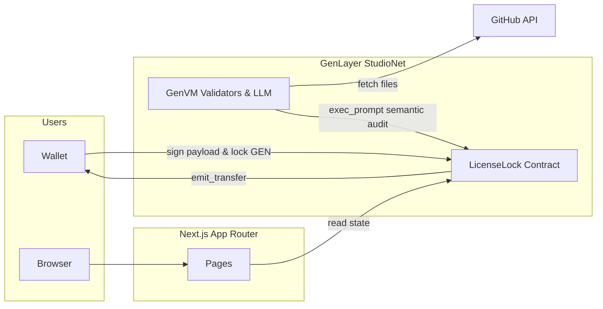
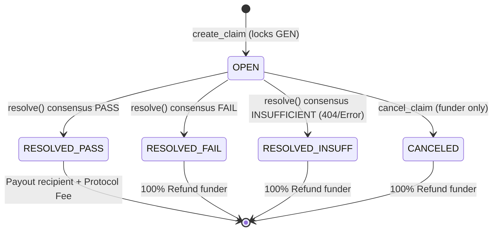

# 🛡️ LicenseLock

**Institutional-Grade Open-Source License Escrow on GenLayer.** Lock GEN tokens against a GitHub commit, trigger decentralized validators to perform AI-driven semantic license audits, and settle payouts or refunds based purely on cryptographic consensus.

[](https://nextjs.org)
[](https://www.genlayer.com)

**Live production dApp:** [licenselock.vercel.app](https://licenselock.vercel.app)

Live StudioNet Contract: `0xC43cB1408B103654A10C73270025AF5caf46C03F`

LicenseLock is an autonomous protocol bridging decentralized escrow with real-world open-source compliance. Validators freeze target repository evidence, utilize native GenVM LLM consensus for semantic evaluation, and strictly route native GenLayer value based on the verified outcome.

---

## At a glance

- **The loop:** lock GEN against a repo → validators fetch evidence and evaluate policies → reach consensus (PASS, FAIL, or INSUFFICIENT) → execute native transfers.
- **Four claim types:** `SPDX_MATCH`, `NO_COPYLEFT`, `ALLOWED_LICENSE_SET`, and `SEMANTIC_AUDIT` (GenVM LLM integration).
- **The one thing worth knowing before anything else:** This protocol was engineered to directly address and resolve the strict architectural constraints established in the Alpha Court, Sybil Court, and Provider Court core team reviews. 

Jump to: [Core Team Audit Resolutions](#core-team-audit-resolutions) · [What LicenseLock is](#what-licenselock-is) · [Architecture](#architecture) · [Local development](#local-development)

---

## Core Team Audit Resolutions

This architecture was explicitly hardened against the findings of prior GenLayer application reviews:

**1. No Trapped Funds & Deterministic Settlement (Alpha Court Resolution)**
Alpha Court highlighted the danger of custodying funds without guaranteed return paths. LicenseLock implements a 0% Revert Guarantee in its LLM parsing. If a node returns unparsable conversational garbage, regex extraction falls back gracefully to `INSUFFICIENT`, unconditionally refunding the user rather than crashing the VM (Status: 6) and trapping state. Furthermore, a strict `cancel_claim` emergency hatch allows funders to reclaim escrows from `OPEN` claims.

**2. Strict Authentication & State-Driven Payouts (Sybil Court Resolution)**
Sybil Court was critiqued for unauthenticated interfaces and disjointed mechanics. LicenseLock normalizes all `msg.sender` addresses and enforces strict access control on cancellations. The UI promises no false mechanics; the `resolve` function actively executes `gl.get_contract_at().emit_transfer()` natively routing funds directly based on consensus state, completely bypassing vulnerable off-chain keeper dependencies.

**3. Adversarial Defenses (Provider Court Resolution)**
To prevent unilateral manipulation, LicenseLock utilizes **Prompt Injection Sandboxing**. A user's `custom_policy_prompt` is strictly wrapped in an immutable system directive, preventing adversarial prompt injections from forcing unauthorized LLM `PASS` verdicts.

---

## What LicenseLock is

### Claim Types

| Type | Question Shape |
|---|---|
| **SPDX Match** | Do the README and LICENSE files explicitly match? |
| **No Copyleft** | Is the repository free of viral licenses (e.g., AGPL-3.0) in both root and manifests? |
| **Allowed Licenses** | Does the repository strictly use a license from a user-provided whitelist array? |
| **Semantic AI Audit** | Does the repository pass a custom, natural language legal requirement evaluated by GenVM LLMs? |

### Lifecycle in plain language

1. Someone **creates a claim**, locking a native GEN escrow against a specific GitHub commit and policy. State is **OPEN**.
2. The user (or any authorized party) triggers **Execute Resolution**.
3. GenLayer validators execute the Nondeterministic Virtual Machine (`gl.nondet`):
    - They crawl the GitHub API (with robust case-insensitive fallback chains and HTTP 429/5xx exponential backoffs).
    - They evaluate the evidence programmatically or via LLM consensus.
4. Consensus is reached and state transitions:
    - **PASS:** The protocol deducts a 2.5% protocol fee to the treasury and transfers the remainder to the recipient. State: **RESOLVED**.
    - **FAIL / INSUFFICIENT:** Evidence is missing or policy is violated. 100% of the escrow is returned to the funder. State: **RESOLVED**.
5. Alternatively, before resolution, the funder can manually abort. State: **CANCELED** (100% refunded).

---

## Architecture



### State Machine



### Tech Stack

| Layer | Stack |
|---|---|
| **App** | Next.js 15 App Router, React, Tailwind CSS |
| **Chain** | GenLayer Intelligent Contract (Python), StudioNet |
| **Wallet** | genlayer-js + viem + MetaMask |
| **Consensus** | GenVM Nondeterministic Web Fetches & Native LLM execution |
| **Tests** | pytest + gltest (19/19 Direct Integration Tests passing) |

---

## Local Development

### Prerequisites
- Node.js 20+
- Python 3.12+
- GenLayer Simulator / Localnet (or StudioNet account)

### Running the Frontend
```bash
npm install
cp .env.example .env.local 
# Add NEXT_PUBLIC_CONTRACT_ADDRESS
npm run dev
```

### Running the GenVM Test Suite
```bash
cd contracts
pip install -r requirements.txt
pytest tests/direct/ -v
```
